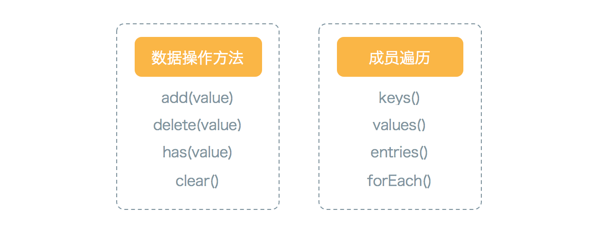
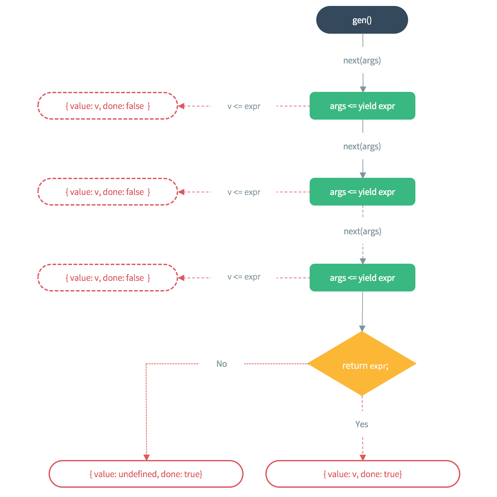

ES2015 是最新的 JavaScript 语法规范，也是前端工程化高速发展所催化出的产物。JS 的不成熟一直为人诟病，前端的高速发展又离不开 JS，所以这次激进的变革显得十分必要。

虽然 ES2015 规范发布了，但是要原生的运行在浏览器上还是受到诸多因素的肘制，比如各版本浏览器的用户量、浏览器厂商对新特性的支持度等等。目前的权宜之计是使用 Babel 之类的编译器将 ES2015 代码转换为 ES5，所以下文中的 ES2015 代码也暂时以 Babel 的解析结果为准。各版本浏览器对 ES2015（ES6）、ES2016（ES7）的支持度可以参考这里：[ES2015 兼容性列表](http://kangax.github.io/compat-table/es6/)。

## 块级作用域和变量声明

ES6 新增了以花括号 `{}` 为标志的块级作用域，用以增强代码的稳健性。在 ES6 之前，JS 中只有全局作用域和函数作用域（eval 作用域？我没用过），这种设计有多种弊端，比如最常见的循环变量泄露为全局变量：

```js
var a = [];

for ( var i = 0; i < 3; i++ ) {
    a[i] = function () {
        return i;
    };
}

console.log(a[1]());
// => 3
```

虽然循环结束了，但是 i 的值在全局作用域内仍然有效，进而形成了一系列的错误。对于这种错误，最常见的处理方式是使用立即执行函数（Immediately-Invoked Function Expression）：

```js
var a = [];

for ( var i = 0; i < 3; i++ ) {
    a[i] = (function (i) {
        return i;
    })(i);
}

console.log(a[1]);
// => 1
```

这里用到的立即执行函数实际上是将[求值策略](http://pinggod.com/2015/%E6%B1%82%E5%80%BC%E7%AD%96%E7%95%A5/)从延迟求值转变为了预先求值，但仍然不够优雅和健壮。在 ES2015 中，通过使用 `let` 来声明循环变量同样可以解决这个问题，而且方式更加简洁：

```js
let a = [];

for ( let i = 0; i < 3; i++ ) {
    a[i] = function () {
        return i;
    };
}

console.log(a[1]());
// => 1
```

`let` 和 `const` 是 ES2015 新增的变量声明指令：let 用来声明变量，const 用来声明常量。当使用 let 和 const 声明变量时，所声明的变量只在当前的块级作用域内有效，这一点是与 var 的本质差别，也是上述代码生效的基础。对于 var 时代的各种诡异特性，现在 let 和 const 做了一些修改：

- let 和 const 声明的变量不存在变量提升
- let 和 const 声明的变量不允许在同一作用域内重复声明多次
- let 和 const 声明的变量必须先声明后使用，否则抛出 ReferenceError

从块级作用域的开始到 let 和 const 变量声明的区域被称为临时死区（temporal dead zone），意指此处调用未声明的 let 和 const 变量一定报错：

```js
if ( true ) {
    temp = 'abc';
    
    // ...
    // blablablabla
    // ...

    // 该行代码之前都属于变量 temp 的 temporal dead zone
    // 意指在此之前不可使用变量 temp
    let temp;
}
```

<div class="tip">
    在浏览器环境下，使用 var 声明的全局变量都会挂载在全局对象 window 下面。ES 2015 规定，使用 var 和 function 声明的全局变量仍然挂载在全局对象下面，但是 let、const 和 class 声明的全局变量则不属于全局对象。
</div>


## 解构赋值

解构赋值是 ES2015 提供的一种语法糖操作，常用于简化对数组和对象的数据提取。可以使用解构赋值的数据类型包括：

- 对象
- 字符串
- 数值和布尔值（自动转换为对象，然后调用 toString() ）
- 数组，以及具有 Iterator 结构的数据结构，比如 Set 等

下面我们通过一些实例来看一下解构赋值的使用方式：

```js
// 1. 交换两个数的值
[x, y] = [y, x]

// 2. 提取 JSON 数据
const JSON = {
    id: 12345,
    status: 'OK',
    data: [123, 456]
};

const { id, status, data } = JSON;

// 3. 按需加载模块
const { Route, DefaultRoute, HistoryLocation } = ReactRouter; 

// 4. 从函数返回多个值
function handleStyle ()  {
    const font = {};
    const border = {};
    const position = {};
  
    return { font, border, position };
}

const {
    font: fontStyle,
    border: borderStyle,
    position: positionStyle
} = handleStyle();

```

解构赋值可以以 `[x = '0'] = [y]` 的形式设置默认值，当 y 不存在时，x 的值就是 0；如果 y 不存在且没有设置默认值，则会被自动赋值为 undefined。

## 字符串

在 JS 内部，字符以 16 位 2 字节的格式存储，这种表示法的范围限制为 `\u0000-\uFFFF`，对于超出范围的字符（`\u20BB7`），会被解析为两个字符四个字节（`\u20BB\u0007`）。ES2015 增强了对 Unicode 的支持，提出了一种新的字符表示方法：`\u{20BB7}`。

对于新的字符表示形式 `\u{codePoint}`，传统的字符串方法已经不适用了，所以 ES2015 提出了一系列新的方法来替代，它们可以正确识别编码大于 \uFFFF 的字符：

- at()，对应 charAt()，返回指定位置的字符
- codePointAt()，对应 charCodeAt()，返回指定位置字符的编码
- String.fromCodePoint()，对应 String.fromCharCode()，返回指定编码所对应的字符

```js
'\u20BB7'
// => '₻7'

'\u{20BB7}'
// => '𠮷'

'\u{20BB7}'.charAt(0)   
// => '�'
'\u{20BB7}'.at(0)       
// => "𠮷"

'\u{20BB7}'.codePointAt(0).toString(16)
// => 20BB7
'\u{20BB7}'.codePointAt(1).toString(16)
// => DFB7
'\u{20BB7}'.charCodeAt(1).toString(16)
// => DFB7

'a\u{20BB7}b'.length
// => 4
Array.from('a\u{20BB7}b').length
// => 3
```

ES2015 规范中规定字符串实现了 Iterator 接口，用于 for ... of 遍历，此外，增加了一些工具类方法：

```js
const str = "abcdefghi";

// 判断字符串 str 是否以参数字符串开头
str.startsWith('abc');
// 判断字符串 str 是否包含参数字符串
str.includes('def');
// 判断字符串 str 是否以参数字符串结尾
str.endsWith('ghi');

// 生成重复字符串
'x'.repeat(3);
// => 'xxx'
```

字符串的另一个强力扩展是：模板字符串和标签模板。模板字符串（template string）类似于其他编程语言中的字符串插值，以反引号（\`）为标志，字符串中的插值部分使用 `${}` 包裹：

```js
const x = 3;
const y = 4;

console.log(`${x} + ${y} = ${x + y}`);
// => '3 + 4 = 7'
```

如果一个函数的函数名之后紧跟一个模板字符串，那么这个函数就会被用来处理这个模板字符串，这个功能被称为`标签模板（tagged template）`：

```js
// 第一个参数是一个数组
// 数组的元素是被插值部分分隔的字符串
// 第二个及以后的参数代表模板字符串中插值部分的值
// 可以使用参数扩展语法将其包裹到一个变量中
function tag(strs, ...values) {
    console.log(strs);
    console.log(values);
}

const x = 3;
const y = 4;

tag`${x} + ${y} = ${x + y}`;
// => [""," + "," = ",""]
// => [3,4,7]
```

标签模板的一个实际运用就是过滤 HTML 字符串，提高安全性：

```js
function safeHTML (strs, ...values) {
    let result = '';

    strs.forEach( (str, index) => {
        let temp = String(values[index]);

        result += str;
        if ( temp ) {
            result += temp.replace(/&/g, '&amp;')
                          .replace(/</g, '$lt;')
                          .replace(/>/g, '&gc;');
        }
    });

    return result;
}

const user = '<html tag>';
const msg = safeHTML`<p>${user} has sent you a msg.</p>`;
// => <p>$lt;html tag&gc; has sent you a msg.</p>undefined
```

## 数值

数值部分，一个是在 Number 对象上丰富了一些工具函数

- Nubmer.isNaN()
- Number.isFinite()
- Number.parseInt()
- Nubmer.parseFloat()
- Nnmber.isInteger()
- Number.EPSILON，极小量常量，在数值比对时，如果小于极小量，则判断两数相等
- Number.isSafeInteger()，安全范围指（-2^53，2^53）
- Number.MAX\_SAFE\_INTEGER
- Number.MIN\_SAFE\_INTEGER

```js
Number.isNaN(NaN);
// => true

Number.isFinite(Infinity);
// => false

Number.isInteger(1.0);
// => true

window.parseFloat === Number.parseFloat
// => true

window.parseInt === Number.parseInt
// => true

0.1 + 0.2
// => 0.30000000000000004

0.1 + 0.2 === 0.3
// => false

0.1 + 0.2 - 0.3 < Number.EPSILON
// => true
```

二是在 Math 对象上扩展了一些数学函数：

- Math.trunc()，去除浮点数的小数部分
- Math.sign()，判断数值是正数、负数还是零
- Math.cbrt()，计算一个数值的立方根
- Math.clz32()，返回一个数值的 32 位无符号整数形式前前导零的个数
- Math.imul()
- Math.fround()
- Math.hypot()
- Math.expn1()
- Math.log1p()
- Math.log10()
- Math.log2()
- Math.sinh()
- Math.cosh()
- Math.tanh()
- Math.asinh()
- Math.acosh()
- Math.atanh()

```js
Math.trunc(3.1415926);
// => 3

Math.cbrt(8);
// => 2

Math.hypot(3, 4);
// => 5

Math.log10(100)
// => 2

Math.log2(16)
// => 4
```

## 数组

在函数中，参数对象 arguments 是一个具有 length 属性的对象，这一类对象被称为类数组对象（array-like object），常见的类数组对象包括 arguments 对象和 DOM 操作返回的 NodeList 集合，对于此类类数组对象，我们往往希望可以将其转换为数组，方便调用数组的方法对数据进行处理。在 ES6 中有一个方法专门用于转换类数组对象为真正的数组：

```js
const obj = { '0': 'a', length: 2 };
const arr = Array.from(obj);

console.log(arr);
// => [ "a", undefined ]
```

从上面的代码可知，对象中的 length 属性确定了转换后数组的长度，索引不匹配的位置返回 undefined，此外 Array.from() 还接受第二个参数，用于对 obj 数据进行 map 处理。此外，对于 ES6 新增的 Set 和 Map 数据结构，也可以使用 Array.from() 转换为数组。

在前面我们遇到了字符串编码大于 \uFFFF 时，字符长度会被误判的问题，这种情况下可以使用 Array.from() 将字符串转换为数组，获取数组的长度：

```js
"𠮷".length
// => 2

Array.from("𠮷").length;
// =>  1
```

数组的构造函数 Array() 一直存在行为不确定的问题（一个参数表示新建数组长度，多个参数表示新建数组的组成元素），对此 ES6 提出了 Array.of() 方法来构建数组。Array.of() 方法接收任意多个参数，这些参数就是返回数组的元素：

```js
Array.of(1, 'a', {}, [], Symbol())
// => [ 1, "a", Object, Array[0], Symbol() ]
```

在众多的数组方法中，有那么一类方法非常值得警惕，这类方法的危险性在于，它们可以修改数组自身的数据，常见方法有：**pop() / push() / shift() / unshift() / reverse() / sort() / splice()**。在 ES6 中也存在两个可以修改数组自身的方法：copyWithin() 和 fill()：

```js
// copyWithin(arrayStart[, copyStart, copyEnd])
// arrayStart: 从数组的该位置开始修改数据
// copyStart: 从数组的该位置开始取数据
// copyEnd: 从数组的该位置停止取数据
[1, 2, 3, 4, 5].copyWithin(0, 3, 4);
// => [ 4, 2, 3, 4, 5 ]

// fill(num, start, end) 方法可以用于数据重置
[1, 2, 3, 4, 5].fill(0, 3, 4);
// => [ 1, 2, 3, 0, 5 ]
```

新增的 find() 和 some() 类似，都需要一个回调函数对遍历到的元素进行判断，不同点在于，find() 返回符合条件的第一个值，some() 则是在遇到复合条件的元素时返回 true；另一个新增的 findIndex() 与 indexOf() 类似，用于在数组中查找特定值的索引，不同之处在于 findIndex() 接收一个回调函数，indexOf() 接收的是一个值，此外，findIndex() 配合 Object.is 可以发现 NaN：

```js
[1, 2, 3, NaN].indexOf(y => Object.is(NaN, y))
// => -1
[1, 2, 3, NaN].findIndex(y => Object.is(NaN, y))
// => 3
```

此外，我们还可以使用 includes() 方法来判断是否存在：

```js
[1, 2, NaN].includes(NaN);
// => true
```

对于数组的遍历，ES6 提供了更精细的方法 entries() / keys() / values()，分别是对键值对、键和值的遍历：

```js
for ( let key of ['a', 'b'].keys() ) {
    console.log(key);
}
// => 0
// => 1

for ( let value of ['a', 'b'].values()) {
    console.log(value);
}
// => 'a'
// => 'b'

for ( let [key, value] of ['a', 'b'].entries()) {
    console.log([key, value]);
}
// => [ 0, "a" ]
// => [ 1, "b" ]
```

最后，值得一提的是，babel 编译已经支持了数组推导式（ES7），这一推到式在 Haskell 和 python 中都有实现：

```js
const years = [ 1954, 1974, 1990, 2006, 2010, 2014 ];
const array = [ for ( year of years ) if ( year > 1990 ) if ( year < 2014 ) year ];
console.log(array);
// => [ 2006, 2010 ]
```

## 函数

先看一个示例：

```js
function f ( x, y = 2, ...z) {
    console.log(`x = ${x}`);
    console.log(`y = ${y}`);
    console.log(`z = ${z}`);
}

f(1, undefined, 2, 3, 5, 8, 13);
// => x = 1
// => y = 2
// => z = 2,3,5,8,13

consoel.log(f.length);
// => 1
```

这个示例中聚合了很多 ES6 在函数方面的特性，第一处是 `y = 2`，这种形式定义了函数参数的默认值，所以这里的 y 相当于一个默认值参数；第二处是 `...z`，这里的 z 被称为 rest 参数，用于存放函数中多余的参数，该参数往往可以用来替代 arguments 对象，因为它天生就是数组类型；第三处是传参时的 undefined，如果我们想跳过某个参数，需要显示的将该参数赋值为 undefined，使用 null 的话没有效果；第四处就是 func.length，这里的 length 表示普通参数的数量，如果我们测试 arugments.length，会发现结果为 7，因为这里的 arguments.length 表示的是传入参数的数量；最后一处不是很明显，但是很重要，就是普通参数、默认值参数和 rest 参数的位置顺序。

进一步还可以配合对象解构来传参：

```js
function fetch(url, { body = '', method = 'GET', headers = {} } ) {
    console.log(method);
}

fetch('http://meituan.com', {});
// => 'GET'

fetch('http://meituan.com');
// => Cannot read property 'body' of undefined
```

第二个 fetch 的问题在于不能省略第二个参数，如果要省略参数，可以设置双重默认值：

```js
function fetch(url, { body = '', method = 'GET', headers = {} } = {} ) {
    console.log(method);
}

fetch('http://meituan.com');
// => 'GET'
```

rest 参数 `...rest` 用于将参数打包成数组，通过扩展运算符 `...`，可以执行逆运算，将数组（babel 也支持对类数对象的转换）转换为以分号分隔的参数序列：

```js
function add (...rest) {
    return [0, ...rest, 21];
}

add(1, 1, 2, 3, 5, 8, 13);
// => [0,1,1,2,3,5,8,13,21]

// 实际运用
// ES5
Math.max.apply(null, [1, 5, 3]);

// ES6
Math.max(...[1, 5, 3]);
```

接下来是比较亮眼的箭头函数`=>`：

```js
// ES5
var f = function(k, v) {
    return { k: v };
}

// ES6
var f = (k, v) => ( { k: v } );
```

看到箭头函数的第一感官就是：简洁。另一个重要的点在于，箭头函数绑定了 this 对象，其特点如下：

1. this 对象的指向是可变，但在箭头函数中，它固定的志向定义时所在的对象，而不是使用时所在的对象
2. 不可以用于构造函数
3. 不可以使用 arguments 对象，可以使用 rest 参数代替
4. 不能用作 Generator 函数，所以不能使用 yield 命令

```js
function foo() {
    setTimeout( () => {
        console.log("id:", this.id);
    },100);
}

foo.call( { id: 42 } );
// id: 42
```

之所以 this 的指向是固定的，根据 babel 的实现来说，是因为箭头函数内并没有 this 对象，无论箭头函数嵌套多少层，它都是指向定时所在的函数：

```js
function foo() {
    return () => {
        return () => {
            return () => {
                console.log("id:", this.id);
            };
        };
    };
}
foo.call( { id: 42 } )()()();

// babel 编译结果
"use strict";
function foo() {
    var _this = this;

    return function () {
        return function () {
            return function () {
                console.log("id:", _this.id);
            };
        };
    };
}
foo.call({ id: 42 })()()();
```

ES7 提出了函数绑定的概念，使用双冒号 `::` 来替代 call/apply/bind 的调用，目前 babel 已经支持该特性，双冒号左侧是一个对象，右侧是一个函数，实现以左边对象为上下文对象的右边函数：

```js
const obj = { id: 123 };
function f () {
    console.log(this.id);
}

obj::f();
// => 123
```

最后，讲讲尾函数调用的优化问题。在函数式编程中，如果某个函数的最后一步是函数调用过程，那么这一过程就成为尾调用：

```js
function f(x){
    return g(x);
}

// 下面的函数并不是尾调用
function f(x){
    g(x);
}

// 上面示例相当于
function f(x){
    g(x);
    return undefined;
}
```

函数调用过程是不断入栈出栈的过程，由于尾调用是最后一步操作，所以不需要保存外层函数的调用，这被称为尾调用优化，即只保留内层函数的调用帧，这种优化的好处是如果函数都是尾调用，那么就可以优化到每次尾调用都只保留一层调用，大大节省内存，这就是尾调用优化的意义。

函数调用自身的过程，成为递归，如果尾调用自身，则称为尾递归。下面是一个阶乘函数，没有使用尾递归，最多需要保存 n 个调用记录，复杂度为 O(n)：

```js
function factorial (n) {
    if ( n === 1 ) return 1;
    return n * factorial( n - 1 );
}

factorial(5);
// => 120

// 使用尾递归改写，只保留一个调用记录，复杂度 O(1)
// Babel 检测到尾调用时使用 while 循环执行函数体
function factorial(n, total) {
  if (n === 1) return total;
  return factorial(n - 1, n * total);
}

factorial(5, 1)
// => 120
```

鉴于尾调用优化的在性能上的良好表现，EMCAScript 明确规定，所有 ECMAScript 的实现都应该实现“尾调用优化”。

为了确保最后一步调用自身实现尾递归优化，就需要把函数内部用到的变量转换为函数的参数，比如上面的 total，不过这样的处理方式并不容易理解，优化方式有两种，一种是函数柯里化，另一种方式就是使用默认值参数：

```js
// 方式一
function currying(fn, n) {
    return function (m) {
        return fn.call(this, m, n);
    };
}
function tailFactorial(n, total) {
    if (n === 1) return total;
    return tailFactorial(n - 1, n * total);
}
const factorial = currying(tailFactorial, 1);
factorial(5);
// => 120

// 方式二
function factorial(n, total = 1) {
  if (n === 1) return total;
  return factorial(n - 1, n * total);
}
factorial(5);
// 120
```

## 对象

ES6 在编码的简洁性上做了很多工作，比如上面的箭头函数，比如下面的对象声明：

```js
const foo = 'bar';
const obj = { foo };
// 相当于 obj = { foo: foo };

const obj = {
    getSth ( x, y ) {
        return { x, y };
        // 相当于 return { x: x, y: y };
    }
    // 相当于 getSth: function ( x, y ) {}
}
```

ES2015 新增了一个 Object.is() 方法来比较两个值是否相等，主要解决两方面的问题：一是 `==` 比较时的数据类型自动转换，一是 `===` 比较时 NaN 不等于自身、`+0` 等于 `-0` 的问题。Object.is() 实现的原则是：只要两个值一样，就应该相等（Same-value equality）。

```js
+0 === -0
// => true
Object.is(+0, -0);
// => false

NaN === NaN;
// => false
Object.is(NaN, NaN);
// => true
```

`Object.assign(target, source1, source2)` 用于将 source1/source2... 的属性拷贝到 target 中，遇到同名属性自动覆盖：

```js
let target = {};
const o1 = { 
    id: 123, 
    meta: { 
        age: 1
    } 
};
const o2 = { 
    meta: {
        age: 2
    }
};
Object.assign(target, o1, o2);
target
// => {"id":123,"meta":{"age":2}}
```

到目前为止，一共有六种方法可以遍历对象的属性：

1. `for...in`，循环遍历对象自身的和集成的可枚举属性（不包含 Symbol 属性）
1. `object.keys(obj)`，返回一个数组，包括自身所有可枚举属性（不含 Symbol 属性和继承属性）
1. `Object.getOwnPropertyNames(obj)`，返回一个数组，包含对象自身的所有属性（不含Symbol属性，包括不可枚举属性）
1. `Object.getOwnPropertySymbols(obj)`，返回一个数组，包含对象自身的所有Symbol属性
1. `Reflect.ownKeys(obj)`，返回一个数组，包含对象自身的所有属性，包括 Symbol 和不可枚举属性
1. `Reflect.enumerate(obj)` 返回一个 Iterator 对象，结果与 `for...in` 相同

以上六种遍历方法，都遵守同样的遍历次序：

- 首先遍历所有属性名为数值的属性，按照数字排序。
- 其次遍历所有属性名为字符串的属性，按照生成时间排序。
- 最后遍历所有属性名为Symbol值的属性，按照生成时间排序。

```js
Reflect.ownKeys({ 
    [Symbol()]:0, 
    b:0, 
    10:0, 
    2:0, 
    a:0 
})
// ['2', '10', 'b', 'a', Symbol()]
```

`__proto__` 是一个没有正式规范，被浏览器广泛支持的属性，ES6 提供了新的方法来代替对该属性的操作：`Object.setPrototypeOf()` / `Object.getPrototypeOf()` / `Object.create()`。

## Symbol

Symbol 是 ES2015 加入的第七种数据类型，它与 `undefined/null/boolean/string/number` 都是原始数据类型，Symbol 用来实现一种独一无二的值：

```js
const s1 = Symbol('foo');
const s2 = Symbol('foo');

typeof s;
// => 'symbol'

s1.toString();
// => 'Symbol(foo)'

s2 === s1;
// => false
```

Symbol 独一无二的特性非常适合作为对象的属性名：

```js
const s = Symbol('foo');
const o = {
    [s]: 'Hi'
};

o.s
// => 'undefined'

0[s]
// => 'hi'
```

在对使用 Symbol 作为属性名的对象进行遍历时，Symbol 属性不会出现在 for...in、for...of 循环中，也不会出现在 Object.keys()、Object.getOwnPropertyNames() 的返回值中。虽然如此，Symbol 并不是私有属性，可以通过 Object.getOwnPropertySymbols() 来获取指定对象的所有 Symbol 属性名：

```js
const s1 = Symbol('foo');
const s2 = Symbol('baz');

const obj = {
    [s1]: 123,
    [s2]: 'abc'
};

const ss = Object.getOwnPropertySymbols(obj);
// [ Symbol(foo), Symbol(baz) ]
```

要获取相同的 Symbol，可以调用系统的 Symbol.for()，该方法接受一个字符串作为参数，它会检测是否存在以该字符串参数名称的 Symbol 值，找到就返回，没有就创建：

```js
const s1 = Symbol.for('foo');
const s2 = Symbol.for('foo');

s1 === s2;
// => true
```

上面示例中用作参数的字符串又被成为 Symbol 的 key，使用 Symbol.keyFor() 可以查看这个 key:

```js
const s = Symbol.for('foo');

Symbol.keyFor(s);
// => 'foo'
```

## Proxy and Reflect

Proxy，顾名思义，用于代替特定对象与外界进行交互的对象，简称代理对象:

```js
const obj = {};
const p = new Proxy(obj, {
    get: function (target, key) {
        console.log(target);
        console.log(`getting ${key}`);
    }
});

p.xxx
// => {}
// => 'getting xxx'
```

Proxy 的拦截操作概览：

- get()，拦截属性的读取
- set()，拦截属性的设置
- has()，拦截 propKey in proxy 操作
- deleteProperty()，拦截 delete proxy[propKey] 操作
- enumerate()，拦截 for ( let x in proxy ) 操作
- ownKeys()
- getOwnPropertyDescriptor()
- defineProperty()
- preventExtensions()
- getPrototypeOf()
- isExtensible()
- setPrototypeOf()
- apply()
- construct()

使用 Proxy.revocable() 可以创建一个可撤销拦截的代理对象：

```js
const { proxy, revoke } = Proxy.revocable({}, {});

proxy.foo = 1;
console.log(proxy.foo);
// => 1

revoke();
console.log(proxy);
// => undefined
```

Reflect 对象的设计初衷：

1. 将 object 对象上明显属于语言内部的方法（Object.defineProperty）放到 Reflect 对象上
1. 修改某些 Object 对象的返回结果，使其更可控，比如 Object.defineProperty() 在无法定义属性时会抛出错误，而 Reflect.defineProperty() 则会返回 false
1. 让 Object 操作统一为函数行为，比如 name in obj 和 delete obj[name]，使用 Reflect.has() 和 Reflect.deleteProperty() 来执行
1. Reflect 对象的方法和 Proxy 对象的方法一一对应，两者高度统一，方便 Proxy 对象调用对应的 Reflect 方法 —— 不管 Proxy 怎么拦截和修改，总可以在 Reflect 上获取默认行为

```js
// Object 操作对比 Reflect 操作
try {
    Object.defineProperty(target, prop, attr);
    // success
}
catch (e) {
    // failure
}

if (Reflect.defineProperty(target, prop, attr)) {
    // success
}
else {
    // failure
}
```

## Set and Map

ES2015 提供的 Set 数据结构是数组的一个约束，两者的差别就在于 Set 中没有重复值：

```js
// Set 的参数必须实现了 iterator 接口
const set = new Set([1, 2, '2', 2, 1]);

console.log(set);
// => [ 1, 2, "2" ]
```

Set 实例绑定的方法可以分为两类：数据操作方法和成员遍历方法：



```js
const set = new Set();

set.add(1);
set.add(2);

set
// => [1, 2]

set.has(2);
// => true

set.delete(2);
// => true

set.clear();

set
// => []

// 数组去重
Array.from(new Set([1, 2, 3, 2, 1]))
// => [1, 2, 3]
```

在遍历时，由于 Set 结构没有键名，只有键值，所以 keys() 和 values() 的返回值一致：

```js
const set = new Set(['red', 'green', 'blue']);

for ( let key of set.keys() ) {
    console.log(key);
}
// => red
// => green
// => blue

for ( let value of set.values() ) {
    console.log(value);
}
// => red
// => green
// => blue

for ( let [key, value] of set.entries() ) {
    console.log([key, value]);
}
// => ["red","red"]
// => ["green","green"]
// => ["blue","blue"]
```

下面是一个 Set 结构的实例，用来求取两个 Set 结构的并交差集：

```js
const x = new Set([1, 2, 3]);
const y = new Set([2, 3, 4]);

// 并集
const union = new Set([...x, ...y]);

// 交集
const intersection = new Set([...x].filter( x => y.has(x) ));

// 差集
const diffset = new Set([...x].filter( x => !y.has(x) ));
```

WeakSet 结构和 Set 结构相似，也是不重复值的集合，差异在于两个地方：一是 WeakSet 内部的元素只能是对象，二是 WeakSet 内部的对象是弱引用，垃圾回收机制不考虑 WeakSet 中对象的引用计数。

由于 WeakSet 结构的对象是弱引用，随时可能消失，所以没有 size 属性，也无法进行遍历，只具有 Set 结构中的三个操作方法：add() / delete() / has()。

Map 结构是对现有 Object 对象的扩展，Object 中的 key 只能是字符串和 Symbol（ES2015 新增），Map 中的 key 可以是任意数据类型：

```js
const map = new Map();
const obj = { id: 123 };

map.set(obj, 'hi');
map.get(obj);
// => 'hi'

map.has(obj);
// true
map.delete(obj);
map.has(obj);
// false

// key 绑定内存地址
map.set({}, 'object');
map.get({});
// => undefined
```

下面在 Map 初始化的时候传入一个二维数组创建 Map：

```js
const map = new Map([
    [1, 'one'],
    [2, 'two'],
    [3, 'three']
]);

for ( let key of map.keys() ) {
    console.log(key);
}
// => 1
// => 2
// => 3

for ( let value of map.values() ) {
    console.log(value);
}
// => one
// => two
// => three

for ( let [key, value] of map.entries() ) {
    console.log([key, value]);
}
// => [1,"one"]
// => [2,"two"]
// => [3,"three"]
```

WeakMap 是弱引用的 Map 结构，而且 WeakMap 只能以对象作为键值，不接受其他类型的值作为键名。

## Iterator

现在，JS 中表示集合的数据结构包括 String、Array、Object、Map、Set、WeakMap、WeakSet 七种数据结构。Iterator 提供了一种接口，为各种不同的数据结构提供统一的接口，任何数据结构只要部署了 Iterator 结构，就可以完成遍历操作，目前，String、Array、Map 和 Set 是默认部署了该接口的数据结构，Array-like object 可以通过 Array.from() 转换为 Array 使用该接口。

Iterator 的作用主要有三点：

- 为数据结构提供统一的访问接口
- 使得数据接口的成员可以按照某种次序排列
- 供 for...of 使用

```js
const arr = [1, 2, 3];
const it = arr[Symbol.iterator]();

it.next();
// => Object { value: 1, done: false }
it.next()
// => Object { value: 2, done: false }
it.next()
// => Object { value: 3, done: false }
it.next()
// => Object { value: undefined, done: true }
```

凡是数据结构原生部署了 Symbol.iterator 属性，则具备 Iterator 接口，调用该接口，就可以得到一个遍历器对象。遍历器对象调用 next() 方法一次可以得到数据结构的所有成员，next() 返回一个对象，包括 value 和 done 属性。

ES6 规定，默认的 Iterator 接口部署在数据结构的 Symbol.iterator 属性上，部署该属性的数据结构都被认为是可遍历的。在某些场合会自动调用遍历器接口：

```js
// 解构赋值
[x, y] = [x, y]

// 扩展运算符
[...'hello']
// => [ "h", "e", "l", "l", "o" ]

// 其他
for ... of
Array.from()
Map() / Set() / WeakMap() / WeakSet()
Promise.all()
Promis.race()

// yield*
function* gen () {
    yield* [1, 2, 3];
}

const it = gen();

it.next();
// => Object { value: 1, done: false }
it.next()
// => Object { value: 2, done: false }
it.next()
// => Object { value: 3, done: false }
it.next()
// => Object { value: undefined, done: true }
```

遍历语法的发展：

- for 遍历，语法繁琐
- forEach()，不能使用 break、continue、return 退出循环
- for...in，为对象设计，遍历数组时会自动将索引转换为字符串
- for...of，修复上述问题，可以遍历实现 iterator 接口的数据接口，不支持对普通对象的遍历

```js
const arr = ['a', 'b', 'c'];

for ( let key in arr ) {
    console.log([key, arr[key]]);
}
// => [ "0", "a" ]
// => [ "1", "b" ]
// => [ "2", "c" ]

for ( let [key, value] of arr.entries() ) {
    console.log([key, value]);
} 
// => [ 0, "a" ]
// => [ 1, "b" ]
// => [ 2, "c" ]
```

## Generator

Generator 函数是 ES2015 提供的一种异步编程解决方案。可以将 Generator 视为一个有限状态机，内部封装了多个状态：

```js
function* gen () {
    yield 1;
    yield 2;
    yield 3;
}

const it = gen();

it.next();
// => Object { value: 1, done: false }
it.next()
// => Object { value: 2, done: false }
it.next()
// => Object { value: 3, done: false }
it.next()
// => Object { value: undefined, done: true }
```

Generator 函数返回的遍历器对象需要调用 next 函数才会遍历到下一个内部状态，并且通过函数内部的 yield 命名挂起函数。遍历器对象 next 方法的运行逻辑：

1. 执行 next 函数，遇到 yield 命令挂起函数的执行，并且返回 yield 命令后表达式的值，作为返回的遍历器对象的 value 属性
1. 继续执行 next 函数，直到遇到下一个 yield，然后挂起函数
1. 如果没有再遇到 return，就运行到函数结束。函数结束时如果有 return，返回 return 后面表达式的值作为返回对象的 value 属性
1. 如果没有 return 表达式，则返回对象的 value 属性为 undefined



```js
function* gen () {
    const ret = yield 1;
    yield ret;
}

const g = gen();

g.next();
// => Object { value: 1, done: false }
g.next(true)
// => Object { value: true, done: false }
g.next()
// => Object { value: undefined, done: true }
```

Generator 函数返回的对象都部署了 Iterator 接口 [Symbol.iterator]，所以，我们可以使用 for...of 循环来遍历 Generator 函数，当返回对象的 done 属性为 true 时，循环自动中止：

```js
function* gen() {
    yield 1;
    yield 2;
    yield 3;
}

for ( let v of gen() ) {
    console.log(v);
}
// => 1
// => 2
// => 3
```

Generator 返回的对象附带两个方法：throw() 和 return，用于手动抛出异常和结束 Generator 函数。

如果要在 Generator 函数内调用另外一个 Generator 函数，需要使用 `yield*`，实际上如果 yield 后面跟的是一个遍历器对象，都可以使用 `yield*` 来解析：

```js
function* gen() {
    yield 1;
    yield* [2, 3, 4];
    // 等同于 
    // yield 2;
    // yield 3;
    // yield 4;
    yield 5;
}

const g = gen();

g.next();
// => Object { value: 1, done: false }
g.next()
// => Object { value: 2, done: false }
g.next()
// => Object { value: 3, done: false }
g.next()
// => Object { value: 4, done: false }
g.next()
// => Object { value: 5, done: false }
g.next()
// => Object { value: undefined, done: true }
```

如果对象的某个属性是 Generator 函数，形式上有所不同：

```js
const obj = {
    * gen () {
        yield 1;
        yield 2;
    }
};

const g = obj.gen();

g.next();
// => Object { value: 1, done: false }
g.next()
// => Object { value: 2, done: false }
g.next()
// => Object { value: undefined, done: true }
```

前面有数组推导，Generator 函数也有推导，Generator 函数推导的优势在于它是惰性求值：

```js
function* bigArr () {
    for ( let i = 0; i < 1000000; i++ ) {
        yield i;
    }
}

const ret = ( for ( n of bigArr() ) if ( n < 10 ) n * n );

[...ret]
// => [ 0, 1, 4, 9, 16, 25, 36, 49, 64, 81 ]
```

下面是使用 Generator 函数实现的一个状态机：

```js
function* gen() {
    while( true ) {
        yield _;
        console.log('on');

        yield _;
        console.log('off');
    }
}

const g = gen();

g.next()
// on
g.next()
// off
g.next()
// on
// ...
```

JS 解析引擎是单线程，只能保持一个调用栈，为了保持多个任务独立的调用栈，引入了协程。Generator 函数是 ES2015 对协程的实现，但不是完整的实现，完整的协程应该可以通过任何函数实现暂停，但是只有 Generator 函数的调用者才能结束 Generator 函数。

如果将 Generator 函数当做协程，可以将多个需要写作的任务都写成 Generator 函数，使用 yield 命令交换控制权。

## Promise

在 ES2015 之前，Promise 早有实现，ES2015 规范统一了 Promise 的用法。Promise 对象共有三个状态：Pending、Resolved 和 Rejected。Promise 对象的状态只能从 Pending 变为 Resolved 或者从 Pending 变为 Rejected。

Promise 对象存在的价值是将异步操作以同步操作的流程表达出来，避免层层嵌套的回调函数，并且提供了统一的接口，便于控制异步操作。不过，Promise 也存在一些缺点：

- 创建后立即执行，无法中途取消
- 如果不设置回调函数，无法抛出内部错误
- 处于 Pending 状态时，无法获得具体状态（刚刚开始还是即将完成）

ES2015 规定，Promise 对象是一个构造函数，用于生成 Promise 实例：

```js
const p = new Promise( (resolve, reject) => {
    setTimeout(resolve, 1000, 'done');
});

p.then((value) => {
    console.log(value);
});
// 1000ms 后
// => 'done'
```

Promise 实例具有两个方法：then(resolved，rejected) 和 catch()。catch() 相当于是 `.them(null, rejected)` 的缩写，用于指定发生错误时的回调函数。

Promise 对象本身还有四个方法：all()、race()、resolve()、reject()。Promise.all() 方法接收包含多个 Promise 实例的一个数组，打包封装成一个 Promise 实例：

```js
const p = new Promise.all([p1, p2, p3]);
// p 的状态取决于 p1、p2、p3
// p1、p2、p3 全部 resolved 时，p resolved
// p1、p2、p3 有一个 rejected，p rejected
```

Promise.race() 同样打包多个返回一个 Promise 实例：

```js
const p = new Promise.race([p1, p2, p3]);
// 与 Promise.all() 的不同之处在于，
// p 的状态取决于 p1、p2、p3 中状态最先发生变化的那个
```

Promise.resolve() 方法用于将现有对象转换为 Promise 对象；Promise.reject() 方法返回一个 Promise 实例，该实例的默认状态就是 rejected。

ES2015 的 Promise API 并不是很多，可以根据自己的开发需要部署特定的方法，比如我们可以部署两个比较常用的方法：done() 和 finally()。Promise 实例以 then() 或 catch() 方法作为结尾方法时，如果结尾方法抛出错误，是有可能无法捕捉到的，所以可以实现一个 done 方法置于回调链的结尾，保证抛出的任何方法都能被捕获：

```js
Promise.prototype.done = function (onFulfilled, onRejected) {
    this.then(onFulfilled, onRejected)
        .catch(function (reason) {
            // 抛出一个全局错误
            setTimeout(() => { throw reason }, 0);
        });
};
```

finally() 方法用于指定回调链的最终操作，与 done 方法的区别在于，它接受一个普通的回调函数作为参数：

```js
// 服务器使用 Promise 处理请求，使用 finally 关掉服务器
server.listen(0)
    .then(function () {})
    .finally(server.stop);

Promise.prototype.finally = function (callback) {
    let P = this.constructor;
    return this.then(
        value  => P.resolve(callback()).then(() => value),
        reason => P.resolve(callback()).then(() => { throw reason })
    );
};
```

## Async 

我们有回调函数、Promise 以及 Generator 这三种异步编程方式了，为什么在此之外还要提供 Async 函数？因为它们本身还有一些问题：

- 回调函数的最大问题是回调嵌套
- Promise 解决了回调嵌套的问题，但是被 then 方法包装后的代码存在冗余问题，语义和理解性较差
- Generator 的代码写起来非常像同步代码，如果去除 yield 命令，简直就是同步代码，但是它失去了 Promise 可以自动执行的特性，所以它的缺点就是需要创建一个自动执行函数（Thunk 函数），或者使用三方模块（co），总之要驱动它自执行。

```js
// Callback Hell
function foo( finalCallback ) {
    request.get(url1, function(err1, res1) {
        if (err1) return finalCallback(err1);
        
        request.post(url2, function(err2, res2) {
            if (err2) return finalCallback(err2);
            
            request.put(url3, function(err3, res3) {
                if (err3) return finalCallback(err3);
                
                request.del(url4, function(err4, res4) {
                    if (err4) return finalCallback(err4);
                    
                    finalCallback(null, "whew all done");
                })
            })
        })
    })
}

// Promise
function foo () {
    return request.getAsync(url1)
        .then(function(res1) {
            return request.postAsync(url2);
        })
        .then(function(res2) {
            return request.putAsync(url3);
        })
        .then(function(res3) {
            return request.delAsync(url4);
        })
        .then(function(res4) {
            return "whew all done";
        });
}

// Generator
import co from 'co';

function* foo() {
    const res1 = yield request.getAsync(url1);
    const res2 = yield request.getAsync(url2);
    const res3 = yield request.getAsync(url3);
    const res4 = yield request.getAsync(url4);
    return "whew all done";
}

co(gen);

// Async
async function foo() {
    const res1 = await request.getAsync(url1);
    const res2 = await request.getAsync(url2);
    const res3 = await request.getAsync(url3);
    const res4 = await request.getAsync(url4);
    return "whew all done";
}
```

编译器的惰性求值往往是将参数放入临时函数中实现的，在求值时调用这个临时函数，这个临时函数叫做 Thunk 函数：

```js
function temp ( v ) {
    return v * 2;
}

temp( x + 5 );

// 等同于
const thunk = function () {
    return x + 5;
}

function temp ( v ) {
    return thunk() + 5;
}
```

在 JS 中，Thunk 函数要做的是将多参数函数转换为单参数函数，且只接受回调函数作为参数：

```js
// 正常版本的readFile（多参数版本）
fs.readFile(fileName, callback);

// Thunk版本的readFile（单参数版本）
var readFileThunk = Thunk(fileName);
readFileThunk(callback);

var Thunk = function (fileName){
    return function (callback){
        return fs.readFile(fileName, callback);
    };
};
```

任何函数，只要参数是回调函数，就能写成 Thunk 函数的形式，下面是一个简单的 Thunk 函数转换器：

```js
var Thunk = function(fn){
    return function (){
        var args = Array.prototype.slice.call(arguments);
        return function (callback){
            args.push(callback);
            return fn.apply(this, args);
        }
    };
};
```

之所以要提 Thunk 函数，是因为它可以驱动 Generator 函数自执行：

```js
function run(fn) {
    var gen = fn();
    function next(err, data) {
        var result = gen.next(data);
        if (result.done) return;
        result.value(next);
    }
    next();
}

run(gen);
```

ES7 提供了 Async 函数，它相当于是 Generator 函数的语法糖。下面使用两种函数读取文件：

```js
const fs = require('fs');

cosnt readFile = function (fileName){
    return new Promise(function (resolve, reject){
        fs.readFile(fileName, function(error, data){
            if (error) {
                reject(error);
            }
            else {
                resolve(data);
            }
        });
    });
};

// Generator 函数
const gen = function* (){
    const f1 = yield readFile('/etc/fstab');
    const f2 = yield readFile('/etc/shells');
    console.log(f1.toString());
    console.log(f2.toString());
};

// Async
cosnt asyncReadFile = async function (){
    cosnt f1 = await readFile('/etc/fstab');
    cosnt f2 = await readFile('/etc/shells');
    console.log(f1.toString());
    console.log(f2.toString());
};
```

首先，两者在语法上有所不同，但这不是最重要的，重要的是一下三点：

1. Async 函数内置自动执行器，而 Generator 需要自己写自动执行函数或者使用第三方库，比如 co
1. 更广的适应性，co 模块约定 yield 后面只能是 Thunk 函数或者是 Promise 对象，而 Async 函数的 await 后面可以使用 Promise 对象或原始值类型（此时等于同步操作）
1. Async 的返回值是 Promise 对象，这比 Generator 返回的 Iterator 对象要更方便一些，可以使用 then() 来制定下一步的操作逻辑

```js
function timeout(ms) {
    return new Promise((resolve) => {
        setTimeout(resolve, ms);
    });
}

async function asyncPrint(value, ms) {
    await timeout(ms);
    console.log(value)
}

asyncPrint('hello world', 50);
```

await 命令后面跟着一个 Promise 对象，运行结果可能是 rejected，需要使用 try...catch 来捕获异常：

```js
async function foo () {
    try {
        await P();
    }
    catch (err) {
        console.log(err);
    }
}

// Or
async function foo () {
    await P().catch( err => console.log(err) );
}
```

## Class

JS 传统的原型继承等方式和其他语言差异较大，造成了一定的学习难度。ES2015 提供了和其他语言相仿的面向对象语法，引入了 Class 的概念，用作对象的模板：

```js
class Point {
    constructor( x, y ) {
        this.x = x;
        this.y = y;
    }

    getInfo () {
        console.log(`( ${this.x}, ${this.y} )`);
    }
}

const p = new Point(3, 4);
p.getInfo();
// => ( 3, 4 )
```

上例中的 constructor 是构造方法，this 代表实例对象。constructor 方法是类的默认方法，使用 new 命令生成对象实例时，自动调用盖房，如果没有显示定义该方法，就会自动添加一个空的 constructor 方法，constructor 方法默认返回类的实例对象，该返回值完全是可以修改的。

Class 之间使用 extends 关键字实现继承，这种写法比 ES5 要简洁很多：

```js
class Point {
    constructor( x, y ) {
        this.x = x;
        this.y = y;
    }

    getInfo () {
        return `( ${this.x}, ${this.y} )`;
    }
}

class ColorPoint extends Point {
    constructor ( x, y, color ) {
        super(x, y);
        this.color = color;
    }

    getInfo () {
        console.log( super.getInfo() + ` is ${this.color}` );
    }
}

const cp = new ColorPoint( 3, 4, 'red' );
cp.getInfo();
// => ( 3, 4 ) is red
```

在继承类的构造函数中出现了 super()，它指代父类的 this 对象。子类必须在 constructor 中调用 super 方法，否则新建实例会报错，这是因为子类没有自己的 this 对象，而是使用继承自父类的 this 对象，一切都是基于对这个 this 的加工处理，如果不调用 super()，就得不到 this 对象。

```js
class Point {}
class ColorPoint extends Point {
    constructor() {
      console.log(this);
    }
}

const cp = new ColorPoint();
// => Babel: 'this' is not allowed before super()
// => Firefox: ReferenceError: |this| used uninitialized in ColorPoint class constructor
```

> ES5 的原型继承，实质是先创造子类的实例对象 this，然后再讲父类的方法添加到 this 上。ES6 的继承机制则是相反的，实质是先创造父类的实例对象 this（调用 super() ），然后在用子类的构造函数修改 this。

类相当于实例的原型，类中定义的方法都会被实例所继承，如果不想让实例继承继承某个方法，可以通过 static 关键字设置类的静态方法：

```js
class Foo {
    static getInfo () {
        console.log('foo');
    }
}

const f = new Foo();

Foo.getInfo();
// => 'foo'
f.getInfo();
// => TypeError: f.getInfo is not a function
```

ES2015 规定类内部只有静态方法，没有静态属性，ES2016 有一个静态属性的提案，目前 Babel 已经支持：


```js
class Point {
    position = [1, 2];

    static color = 'red';
}
```

new 是从类生成实例的命令，ES2015 的 new 命令增加了一个 `new.target` 的属性，表示 new 引用的构造函数：

```js
class Point {
    constructor () {
        if ( new.target === Point ) {
            console.log('right');
        }
        else {
            console.log('wrong');
        }        
    }
}

const p = new Point();
// => right
Point.call(p, 123);
// => Babel: wrong
// => Firefox: TypeError: class constructors must be invoked with |new|
```

在子类继承父类时，new.target 返回的是子类，利用这个特点，可以写出不能独立使用、必须继承后才能使用的类：

```js
class Shape {
    constructor() {
        if (new.target === Shape) {
            throw new Error('本类不能实例化');
        }
    }
}

const s = new Shape();
// => Error: 本类不能实例化 
```

## Decorator

ES2016 的 Decorator 相当于设计模式中的装饰模式，所以下文就以装饰器来指代 Decorator。与上面提到的 Proxy（代理者，代理模式）不同，装饰器的核心作用是增强被装饰者的功能，而代理对象的作用是管理外界对被代理者的访问权限。装饰器只能用于类和类的方法，不能用于函数，因为编译时存在函数提升。修饰漆对类的行为的改变，是代码编译时发生的，而不是运行时，这意味着，修饰漆能在编译阶段运行代码：

```js
function mixins(...list) {
    return function (target, name, descriptor) {
        Object.assign(target.prototype, ...list);
    }
}

const Foo = {
    foo () {
        console.log('foo');
    }
}

@mixins(Foo)
class CLS {}

const obj = new CLS();
obj.foo();
// 'foo'
```

装饰器函数可以接收三个参数：目标函数、属性名和属性的描述对象。上例代码通过装饰器 mixins，为指定类添加了指定的方法。装饰器的一个实际应用就是注释:

```js
import { readonly } from 'core-decorators';

class Meal extends {
    @readonly
    entree = 'steak';
}

const dinner = new Meal();
dinner.entree = 'salmon';
// Cannot assign to read only property 'entree' of [object Object]
```

除了注释功能，装饰器还能用作类型检查，长期来看，它将成为 JavaScript 代码静态分析的重要工具。

## Module

在 ES2015 之前，社区中主要有 CommonJS 和 AMD 两种模块加载方式，ES2015 提出了自己的模块功能，其设计思想是尽量的静态化，在编译时确定模块的依赖关系、输入输出变量。

ES2015 module 主要由两个命令组成：`export` 和 `import`。export 用于提供对外接口，import 用于引用外部模块。每个模块都是独立的文件，外部无法直接获取模块文件的变量，只能通过 export 对外输出变量。

```js
// 输出变量
const foo = 'foo';
const bar = 'bar';
export { foo, bar };

// 输出函数和类
export function f() {}
export class C {}
```

`export` 定义了外部接口之后，可以使用 `import` 命令在其他模块中加载：

```js
// 使用 as 命令重命名引入的变量
// import 语法存在变量提升，最好置于文件顶部
import { foo, bar as baz } from './modulename';
```

从上面 import 的示例中，我们发现当需要引入外部模块时，必须明确知道模块内部的变量名，这是非常不友好的方式。`export default` 命令就是为了解决这个问题存在的，其作用是为模块指定默认的输出内容：

```js
// 'export-default.js'
export default function () {}

// 'import-default.js'
immport customName from './export-default.js';
```

## 参考资料

- [ECMAScript6 入门](http://es6.ruanyifeng.com/)
- [MDN JavaScript](https://developer.mozilla.org/zh-CN/docs/Web/JavaScript)

