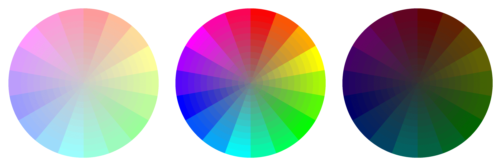

这篇文章记录的是一些我很少使用的 CSS 属性，而这些属性正在流行起来……

## color

CSS 中的颜色值有多种表示方式，常见方式是：关键字（<span style="display: inline-block; width: 18px; height: 18px; margin: 0 4px; background-color: pink; border-radius: 3px; vertical-align: text-top;"></span>pink）、十六进制（<span style="display: inline-block; width: 18px; height: 18px; margin: 0 4px; background-color: #D4838F; border-radius: 3px; vertical-align: text-top;"></span>#D4838F）、RGB（<span style="display: inline-block; width: 18px; height: 18px; margin: 0 4px; background-color: rgba(234, 79, 108, 1); border-radius: 3px; vertical-align: text-top;"></span>rgba(234, 79, 108, 1)）和 HSL（<span style="display: inline-block; width: 18px; height: 18px; margin: 0 4px; background-color: hsla(337, 50%, 42%, 1); border-radius: 3px; vertical-align: text-top;"></span>hsla(337, 50%, 42%, 1)）。在这里重点要介绍的是 HSL 的表示方式，这里的 HSL 分别是指色相（Hue, H）、饱和度（Saturation, S）和明度（Lightness, L）。为什么要强调这种方式呢？因为它可以更好的记忆：



- H 色相的属性值范围为 0~360，指示的颜色依次是红橙黄绿青蓝紫
- S 饱和度的属性值范围为 0%~100%，值越大，颜色越亮越鲜艳；值越小，颜色越黑越暗淡
- L 明度，也称为亮度，属性值为 0%~100%，值越大，白色越明显；值越小，黑色越明显

## size

这里要说的是几个新的长度单位（假设 viewport 尺寸为：1400 * 900）：

- `vw`，宽度单位，`1vw = 1 / 100 * 1400`
- `vh`，高度单位，`1vh = 1 / 100 * 900`
- `vmin`，长度单位，1vmin 等于 1vw 和 1vh 中的最小值
- `vmax`，长度单位，1vmax 等于 1vw 和 1vh 中的最大值

目前来看，使用这些长度单位可以让页面任意元素与窗口尺寸形成直接联动，避免子元素对父元素在尺寸上的依赖，比如以前要实现 100% 宽高的话，需要预先设置 html 和 body 的宽高为 100%。

## clip

clip，是一个用于裁剪的属性，在某种程度上也是对元素的局部切割，这个属性的兼容性极好，但只能作用于绝对定位的元素：

```css
.box {
    position: absolute;
    clip: rect(10px 100px 100px 10px);
}
```

上面代码的意思是将 `.box` 元素进行绝对定位并裁剪，裁剪方式是矩形裁剪，这个矩形的范围由 `rect(top: 10px right: 100px bottom: 100px left:10px)` 决定，也就是说裁剪后的水平方向由 `right - left` 的值决定，裁剪后垂直方向的值由 `bottom - top` 决定，所以 right 值必须大于 left，bottom 值必须大于 top 值。CSS3 中制定了一个更强大的裁剪属性：`clip-path`，使用它可以裁剪出各种常用图形，如果你想了解这一属性的基础知识，可以阅读文章[《運用 clip-path 的純 CSS 形狀變換》](http://www.oxxostudio.tw/articles/201503/css-clip-path.html)。

## background

这里之所要记录一下 background，是因为我很少使用 `background` 这个简写属性，特地了解一下其结构，依次为：

- `background-color`，背景颜色
- `background-position`，控制背景图片的起始位置
- `background-size`，控制背景图片的尺寸
- `background-repeat`，控制是否以及如何重复背景图片
- `background-origin`，控制背景图片相对元素框模型的定位方式，包括三种方式：`padding-box`，相对于内边距定位；`border-box`，相对于边框定位；`content-box`，相对于内容块定位
- `background-clip`，裁剪背景图片的绘制区域，包括三种区域：`border-box`，边框及边框以内；`padding-box`，内边距及内边距以内；`content-box`，内容区
- `background-attachment`，控制背景图片是固定不动还是随鼠标滚动
- `background-image`，背景图片的地址，比如 `background-image: url(http://xxx.com/a.png)`

这里我不常用的属性是 `background-clip` 和 `background-origin`，使用它们可以用于控制背景图片和背景色的渲染范围。

## vertical-align

`vertiacl-align` 是一个常用易错的属性，这个属性只对 `display: inline;` 元素有效，有效值包括：baseline、sub、super、top、text-top、middle、bottom、text-bottom、长度和百分数。在表格单元格中，`vertical-align` 的默认值为 `middle`。

## 堆叠上下文

这是一个经常使用却没有注意的概念，CSS 使用 z-index 控制元素的堆叠顺序。设定 `position` 属性的元素可以称为设定位置的元素，当它们拥有 `index` 属性时就会创建堆叠上下文，上下文的前后顺序由 `index` 的值决定，值越大位置越靠上，顺序如下：

1. 堆叠上下文元素的背景颜色、背景图片和边框
2. 设置为负值的后代元素
3. 非设定位置的后代元素
4. 非设定位置的后代浮动元素
5. 非设定位置的后代行内元素
6. 设置为 `z-index: auto` 和 `z-index: 0` 的设置位置的后代元素
7. 设置为正直的 z-index 的设定位置的后代元素

## next

这里要记录的三个新 CSS 元素分别是：`currentColor`、`calc()` 和 `var()`。

`currentColor`，当前元素的字体颜色。使用这一属性值的优势在于，可以让当前元素的所有元素围绕当前元素的字体颜色展开，而当前元素的字体颜色又会响应鼠标悬停等状态，形成良好的联动。

`calc()`，用于计算长度。现有的长度单位有很多种，比如 px、vw、%，当元素在 DOM 树中越深时，其接收到的长度单位就会越多，这种时候就可以使用 `cacl()` 进行统一计算，比如 `calc(100% - 3em + 10px)`。

`var()`，用于为 CSS 提供变量，定义的变量必须使用 `--*` 格式的变量名：

```css
:root {
    --main-color: pink;
}

.box {
    color: var(--main-color);
}
```

## 参考资料

- [RGB、HSL、Hex 網頁色彩碼，看完這篇全懂了](http://csscoke.com/2015/01/01/rgb-hsl-hex/)
- [運用 clip-path 的純 CSS 形狀變換](http://www.oxxostudio.tw/articles/201503/css-clip-path.html)
- [vertical-align](http://www.w3cplus.com/css/what-is-vertical-align.html)
- [《HTML5 与 CSS3 设计模式》](https://book.douban.com/subject/20440003/)
