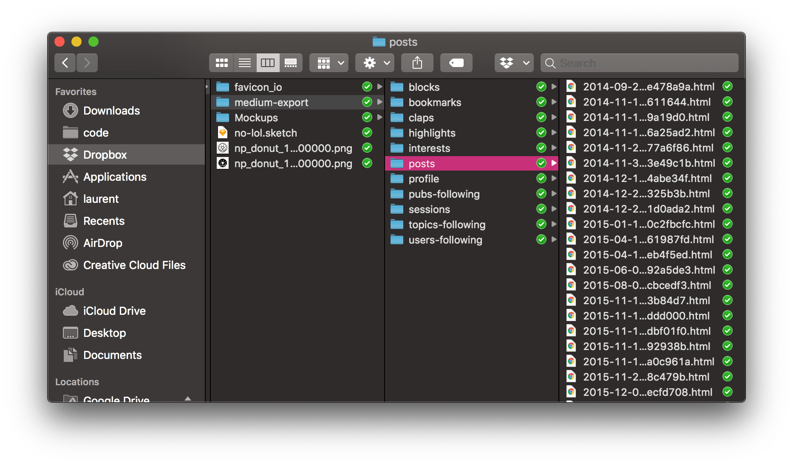

从某种意义上说，网页是印刷的电子化产品，也离不开排版布局等设计工作，网页中的文字排版问题常见于中英文混排时的对齐问题。

## 间距

使用 CSS 控制文字间距是比较简单的一件事，下面属性可以从微观到宏观的调整文字间距：

- `letter-spacing`，调整字与字之间的间距，对于英文来说就是字母之间的间距，对于中文来说就是每个汉字之间的间距
- `word-spacing`，调整‘单词’与‘单词’之间的间距，无论中英文，这里的单词是指被半角空白符包围的独立字块，比如 `使用 CSS 控制...` 中的 `CSS` 就是一个字块，但是 `使用CSS控制...` 中就没有字块
- `line-height`，调整行与行之间的间距

上面三个属性控制了从字母到行之间的间距，如果要调整更大范围的间距，则可以使用 `margin`、`padding` 属性实现。

## 换行

默认情况下，浏览器有一套自己的算法对长文字进行自动换行，但是对于中英文混排或类似 URL 地址的长文字，自动换行的效果不尽人意。首先，我们从最强势的 `white-space` 讲起。`white-space` 主要有两点功能：决定是否对文本中的空白符进行合并，决定哪种情况下进行换行。其属性值也主要包含两类，一类是合并换行符和空白符的 `normal`、`nowrap`，一类是不合并换行符的 `pre`、`pre-wrap` 和 `pre-line`。

`normal` 和 `nowrap` 的共同点就是会对换行符、制表符、空格等符号毫不留情地合并，最终只保留一个半角空格，其中 `normal` 是浏览器默认使用的处理方式，其与 `nowrap` 的区别在于，`nowrap` 绝不换行，而 `normal` 会在溢出时自动换行，但是换行效果不佳。

`pre`、`pre-wrap` 和 `pre-line` 的共同点是保留换行符，三者之间的差异还是比较大的：

- `pre`，保留空白符但绝不自动换行，只根据换行符进行换行，溢出也不换行
- `pre-wrap`，保留空白符，溢出自动换行
- `pre-line`，合并空白符，移出自动换行

I recently moved my blog from [Medium](https://medium.com/@sugarpirate) to a self-managed blog built with [Gatsby](https://www.gatsbyjs.org/) in the [open](https://github.com/poteto/no.lol), then deployed on [Netlify](https://www.netlify.com/). After a few weeks of fiddling around, I feel like I've landed on something I'm mostly happy with.

Despite my many new & old frustrations with Medium, I really enjoyed the writing experience. Whenever I've built my own blogs in the past, inevitably, I spent more time designing and building the damn thing instead of writing content. On Medium, I could _just write_.

In this post I'll describe how I did the transition, and what tools I found along the way that have made the experience of managing my own blog with Gatsby a somewhat painless one. Let's get started!

### Exporting your content off of Medium

The first step is to [download all your information from Medium](https://medium.com/me/export). It'll be sent to you as .zip file containing all your data, including published & draft posts you've written. Once you've uncompressed your files, you'll see a bunch of folders:



Medium posts are exported as html files in the `posts` folder, so we'll want something to convert them to markdown. Alternatively, you could use something like [gatsby-source-medium](https://www.gatsbyjs.org/packages/gatsby-source-medium/?=medium) or [gatsby-source-rss](https://github.com/jondubin/gatsby-source-rss) to add this data to [Gatsby's GraphQL endpoint](https://www.gatsbyjs.org/docs/querying-with-graphql/). I preferred having actual files in my repo so I could make edits as necessary.

After some googling, I found [medium-2-md](https://github.com/gautamdhameja/medium-2-md) by [Gautam Dhameja](https://github.com/gautamdhameja) which seemed promising. You point this script at a local folder containing your Medium posts, and it generates a folder full of markdown files together with basic frontmatter. Having frontmatter included is useful, because it allows us to add interesting metadata to our posts that we can then use when building our blog in Gatsby. Frontmatter looks like this (everything between the `---`):

```markdown
---
title: 'My blog post'
description: >-
  This is a description of my awesome blog post
date: '2019-03-17T00:52:08.562Z'
categories:
  - stuff n things
keywords:
  - my blog post
this:
  - is an array
  - of strings
arbitraryData: is fine to add
---

My content that isn't frontmatter
```

To begin, run the following script, pointing it to the folder which houses your Medium html posts:

```
npx medium-2-md convertLocal path/to/medium-export/posts -f
```

If you want to convert your drafts as well, add the `-d` flag to the command. When the script completes, it'll place a folder within `posts` called `md_<series of numbers>`, which contains all your published posts in markdown format.


### Getting started with Gatsby

Now that we have our posts, we can get our blog going! I started by throwing something together in Sketch, as I found it helpful for me to think about different ideas I wanted to try in the design of my blog. Here's what I originally came up with (quite different from what I actually built!):


#### Setting up

Next, let's get our repo created using the [gatsby-starter-blog](https://github.com/gatsbyjs/gatsby-starter-blog) starter. There are lots of different [starters](https://www.gatsbyjs.org/starters/?v=2) when you're creating something with Gatsby, but I found this one good enough to be a base. Follow the instructions in the gatsby-starter-blog repo after you've also installed [gatsby-cli](https://www.gatsbyjs.org/docs/gatsby-cli/). If you did it right, you should have a new folder with the following (or similar) structure:


At this point, I moved my markdown posts into the `content/blog` folder, and had to do a bunch of cleanup to prettify the markdown. One thing that made the conversion process difficult was that in my Medium posts, I added code snippets by embedding GitHub gists. This meant that the code snippets in my posts didn't get converted, so I had to do some manual work here with copypasta.

#### How does Gatsby even?

Once you've cleaned up your posts, you should have a bare bones, basic blog built with Gatsby. I'm not going to comprehensively cover what Gatsby does or how it works in the post, but the [docs](https://www.gatsbyjs.org/docs/) and [tutorial](https://www.gatsbyjs.org/tutorial/) are excellent ways to get started. What you should know about Gatsby is that it's really a static progressive web app (PWA) generator. It's like [Jekyll](https://jekyllrb.com/) and [create-react-app](https://github.com/facebook/create-react-app) combined. In their own words:

> Gatsby.js is a static PWA (Progressive Web App) generator. You get code and data splitting out-of-the-box. Gatsby loads only the critical HTML, CSS, data, and JavaScript so your site loads as fast as possible. Once loaded, Gatsby prefetches resources for other pages so clicking around the site feels incredibly fast.

Which parts of my Gatsby app are static? It wasn't initially obvious to me. It eventually dawned on me that Gatsby tries to do as many things at build time in order to generate static assets. For example, if you can have Gatsby query your data at build time (such as from your filesystem, an external API, a database, etc), then static files can be generated from that data. The resulting artifact is then completely static.

During run time, your Gatsby app can respond immediately with static assets while hydrating itself with [additional data](https://www.gatsbyjs.org/docs/building-apps-with-gatsby/) / interactivity as needed after initial render. It's not _just_ a static site generator! It also uses GraphQL in a fairly novel way as a layer for your React client to work with. For example, the markdown blog posts you've added, the metadata for your site, the image assets and more are all exposed to your React client via GraphQL.

The cool thing about Gatsby's architecture, is that in addition to the runtime ecosystem for application concerns via React components, it also opens up the possibility for reusable [plugins](https://www.gatsbyjs.org/plugins/) that work on your _build_ itself. For example, if you wanted to create an RSS feed for your blog, you could quickly download a plugin ([gatsby-plugin-feed](https://www.gatsbyjs.org/packages/gatsby-plugin-feed/)) that can do that for you at build time. That's amazing!

### Automate all the things

Throughout the process of creating my blog, I found the following tools that made my life easier.

#### Deploying your blog with Netlify

Getting your blog deployed with [Netlify](https://netlify.com) is a breeze. Once you've created a new site in Netlify, you can quickly turn on automatic deployments as well as deploy previews. Deploy previews are built for every PR, and lets you quickly take a look at your changes before merging into master. You'll also want to use Netlify's DNS if you can, because that will allow them to provision a wildcard SSL certificate for you, meaning both your "naked" (meaning https://no.lol) domain and "www" (https://www.no.lol) domain will both have SSL.

#### Add the lighthousebot for continuous performance testing

After some headscratching, I finally figured out how to get the [lighthousebot](https://github.com/GoogleChromeLabs/lighthousebot) to automatically run in CI for every pull request. If you're not familiar with [Lighthouse](https://developers.google.com/web/tools/lighthouse/), it's a developer tool released by the Chrome team that helps you audit your site for performance, accessibility, progressive web apps, and more. You can run a lighthouse audit in your Chrome DevTools without installing anything:


To get started with lighthousebot, follow the instructions in the [lighthousebot](https://github.com/GoogleChromeLabs/lighthousebot) repo. You'll need to:

1. Add `@lighthousebot` as a collaborator to your repo
2. Request a lighthousebot API key
3. Add the API key as an environment variable to TravisCI
4. Then run it against your Netlify deploy preview so you can look at score changes before merging your PR


Because you need to wait for the Netlify deploy preview to finish before you can run lighthousebot, you'll need a little npm package called [wait-for-netlify-preview](https://github.com/Developmint/wait-for-netlify-preview) by [Alexander Lichter](https://github.com/manniL) to let TravisCI wait before running the lighthouse audit. To get this to work, install `wait-for-netlify-preview` as a dev dependency, add an [access token](https://github.com/settings/tokens) with the `repo` permission, and add that as a environment variable in TravisCI: `GITHUB_API_TOKEN = <your access token>`

If you did it right, you should have two environment variables set in TravisCI:


Here's what I added to my TravisCI config and package.json:

```yaml:title=.travis.yml
jobs:
  include:
    - stage: Test
      install: yarn install --frozen-lockfile
      script: yarn test
    - stage: Lighthouse
      if: type = pull_request
      install: yarn install --frozen-lockfile
      script: yarn run lh --perf 90 --pwa 90 --a11y 90 --bp 90 --seo 90 "$(wait-for-netlify-preview)"
```

```json:title=package.json
{
  "scripts": {
    "lh": "lighthousebot"
  }
}
```

Now, when you open a PR, you'll see the following stages in TravisCI:


This is a pretty nice setup! Gatsby gives you incredible performance out of the box, so this addition to your CI process ensures that the code you add won't slow your site down too much ;)

#### Bring on the bots

Some other bots I also found useful:

- [delete-merged-branch](https://github.com/apps/delete-merged-branch): automatically deletes merged branches
- [renovate](https://renovatebot.com): keeps your dependencies up to date, similar to [greenkeeper](https://greenkeeper.io/). I like that you can specify a schedule so the PRs don't get too noisy
- [bors](https://bors.tech/): if you have multiple people contributing to your blog, bors is incredibly helpful! I use this in a bunch of my open source libraries. It helps you prevent ["semantic conflicts"](https://bors.tech/essay/2017/02/02/pitch/) as you merge multiple PRs. It's also pretty cool being able to merge PRs simply by leaving a comment ("bors r+")

If you have any questions or want more details, [tweet at me](https://twitter.com/sugarpirate_). I hope you found this post useful, happy blogging!
