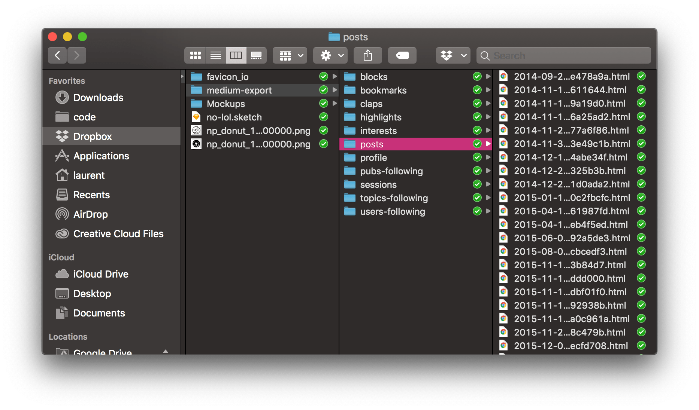

## 中文 哈哈

从**某种意义**上说，网页是印刷的*电子化产品 Telephone*，也离不开排版布局等设计工作，网页中的文字排版问题~~常见于中英文混排~~时的对齐问题。

下面是一个 thematicBreak

---

```js
import Ember from "ember";

var { set } = Ember;

export default Ember.Component.extend({
  classNames: ["draggableDropzone"],
  classNameBindings: ["dragClass"],
  dragClass: "deactivated",

  dragLeave(event) {
    event.preventDefault();
    set(this, "dragClass", "deactivated");
  },

  dragOver(event) {
    event.preventDefault();
    set(this, "dragClass", "activated");
  },

  drop(event) {
    var data = event.dataTransfer.getData("text/data");
    this.sendAction("dropped", data);

    set(this, "dragClass", "deactivated");
  }
});
```

## Key bindings

The GitHub repo [.tmux](https://github.com/gpakosz/.tmux) is a pretty and versatile self-contained tmux configuration which I am using. `C-a` is the prefix key provided by this repo, while we can keep use default `C-b` prefix. The following tables show common key bindings which come into play with prefix key, from session to pane:

---

**SESSION KEY BINGDINGS**

- `tmux ls`，显示所有 session
- `tmux new -s session-name`，新建 session
- `tmux attach -t session-name`，进入 session
- `tmux kill-session -t session-name`，关闭 session

| Key | Description          |
| :-: | :------------------- |
| C-f | find session         |
|  d  | hang-up session      |
|  r  | reload configuration |

**WINDOW KEY BINGDINGS**

|  Key  | Description                              |
| :---: | :--------------------------------------- |
|   c   | create new window                        |
|   ,   | rename current window                    |
|   s   | list all windows                         |
|   f   | find window                              |
|  0~9  | switch window according t 总问阿里斯顿可减肥 o serial number |
|   &   | exit tmux and close current window       |
| space | adjust layout                            |

## 间距

使用 CSS 控制文字间距是比较简单的一件事，下面属性可以从微观到宏观的调整文字间距：

- `letter-spacing`，调整字与字之间的间距，对于英文来说就是字母之间的间距，对于中文来说就是每个汉字之间的间距
- `word-spacing`，调整‘单词’与‘单词’之间的间距，无论中英文，这里的单词是指被半角空白符包围的独立字块，比如 `使用 CSS 控制...` 中的 `CSS` 就是一个字块，但是 `使用CSS控制...` 中就没有字块
- `line-height`，调整行与行之间的间距

上面三个属性控制了从字母到行之间的间距，如果要调整更大范围的间距，则可以使用 `margin`、`padding` 属性实现。

---

### 数学表达式 Math Expression

行内：

$a^2 + b^2 = c^2$

通过 `$$` Block 独占一行

$$
a^2 + b^2 = c^2
$$

## 换行

默认情况下，浏览器有一套自己的算法对长文字进行自动换行，但是对于中英文混排或类似 URL 地址的长文字，自动换行的效果不尽人意。首先，我们从最强势的 `white-space` 讲起。`white-space` 主要有两点功能：决定是否对文本中的空白符进行合并，决定哪种情况下进行换行。其属性值也主要包含两类，一类是合并换行符和空白符的 `normal`、`nowrap`，一类是不合并换行符的 `pre`、`pre-wrap` 和 `pre-line`。

`normal` 和 `nowrap` 的共同点就是会对换行符、制表符、空格等符号毫不留情地合并，最终只保留一个半角空格，其中 `normal` 是浏览器默认使用的处理方式，其与 `nowrap` 的区别在于，`nowrap` 绝不换行，而 `normal` 会在溢出时自动换行，但是换行效果不佳。

`pre`、`pre-wrap` 和 `pre-line` 的共同点是保留换行符，三者之间的差异还是比较大的：

- `pre`，保留空白符但绝不自动换行，只根据换行符进行换行，溢出也不换行
- `pre-wrap`，保留空白符，溢出自动换行
- `pre-line`，合并空白符，移出自动换行

> Gatsby.js is a static PWA (Progressive Web App) generator. You get code and data splitting out-of-the-box. Gatsby loads only the critical HTML, CSS, data, and JavaScript so your site loads as fast as possible. Once loaded, Gatsby prefetches resources for other pages so clicking around the site feels incredibly fast.

### Automate all the things

Throughout the process of creating my blog, I found the following tools that made my life easier.



#### Deploying your blog with Netlify

Getting your blog deployed with [Netlify](https://netlify.com) is a breeze. Once you've created a new site in Netlify, you can quickly turn on automatic deployments as well as deploy previews. Deploy previews are built for every PR, and lets you quickly take a look at your changes before merging into master. You'll also want to use Netlify's DNS if you can, because that will allow them to provision a wildcard SSL certificate for you, meaning both your "naked" (meaning https://no.lol) domain and "www" (https://www.no.lol) domain will both have SSL.

##### Add the lighthousebot for continuous performance testing

1. Add `@lighthousebot` as a collaborator to your repo
2. Request a lighthousebot API key
3. Add the API key as an environment variable to TravisCI
4. Then run it against your Netlify deploy preview so you can look at score changes before merging your PR

```yaml
jobs:
  include:
    - stage: Test
      install: yarn install --frozen-lockfile
      script: yarn test
    - stage: Lighthouse
      if: type = pull_request
      install: yarn install --frozen-lockfile
      script: yarn run lh --perf 90 --pwa 90 --a11y 90 --bp 90 --seo 90 "$(wait-for-netlify-preview)"
```

```json
{
  "scripts": {
    "lh": "lighthousebot"
  }
}
```

###### Bring on the bots

Some other bots I also found useful:
